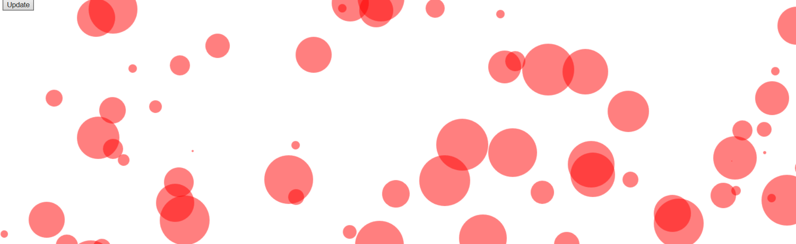
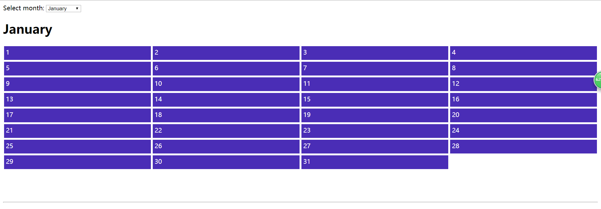
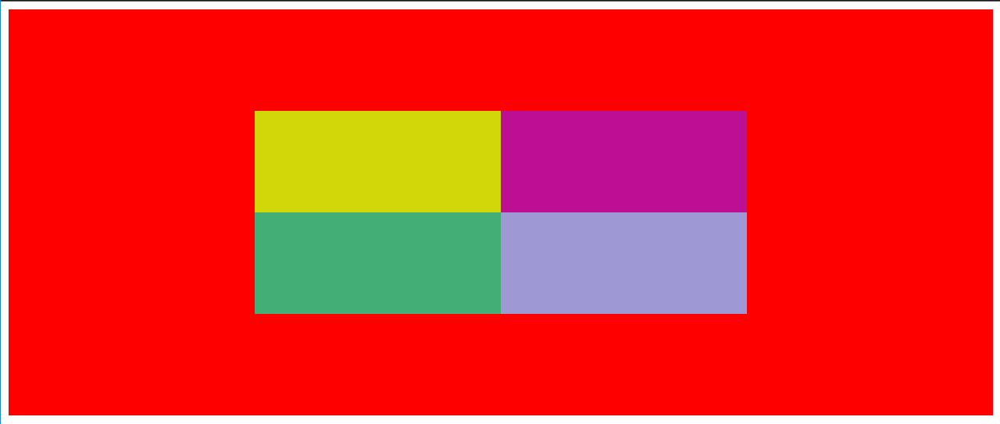
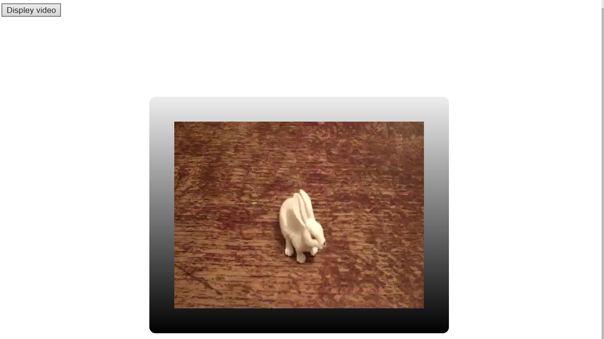
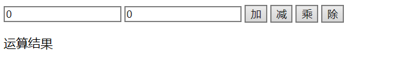

# simple-JavaScript-demo

点击图片即可浏览访问......

canvas.html: 在canvas元素上绘制100个随机圆（按更新按钮一次又一次地运行示例）

demo6.html：一个简单的日历  

demo13.html：每当它们点击时就会为背景添加一个随机颜色 

demo15.html：按钮被单击时，将显示视频，点击灰色区域隐藏盒子，点击视频本身就播放。   

demo17.html：点击下方图片缩略图，上面的大图就相应变化，点击"变暗"按钮给图片加阴影。 

task16.html：简单的加减乘除计算。   

